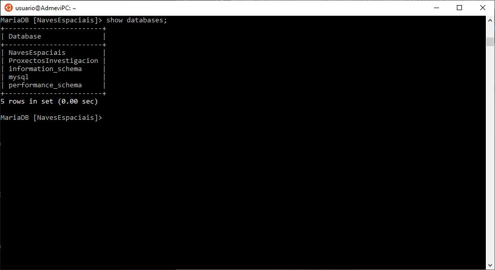
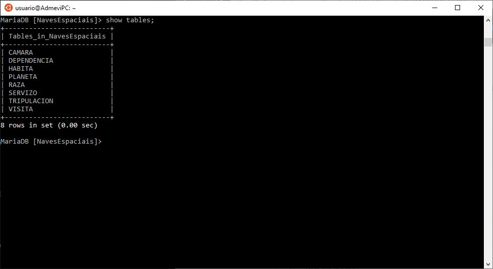
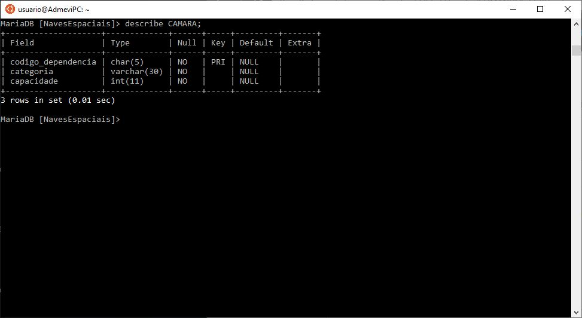

# COMANDOS MARIADB
> A continuación, se mostrará una lista de comandos con los que se podrá visualizar el número de bases de datos, la estructura de una base de datos, las tablas con sus atributos ... dentro de la linea de comandos simulando una GUI.
## Índice
- [Listar bases de datos](#LISTAR-BASES-DE-DATOS)
- [Listar las tablas de una base de datos](#LISTAR-TABLAS-DE-UNA-BASE-DE-DATOS)
- [Mostrar la estructura de una tabla](#MOSTRAR-ESTRUCTURA-DE-UNA-TABLA)

## LISTAR BASES DE DATOS
> El siguiente comando se utiliza para listar todas las bases de datos que hay implementadas en un servidor MariaDB.
- Sintaxis:
```sql
show databases;
```
- Ejemplo:


## LISTAR TABLAS DE UNA BASE DE DATOS
> El siguiente comando se utiliza para listar todas las tablas que hay dentro de una base de datos implementada en MariaDB.
- Sintaxis:
```sql
show tables;
```
- Ejemplo:


## MOSTRAR ESTRUCTURA DE UNA TABLA
> El siguiente comando se utiliza para mostrar la estructura de una tabla que hay dentro de una base de datos implementada en MariaDB.
- Sintaxis:
```sql
describe [table];
```
- Ejemplo:

