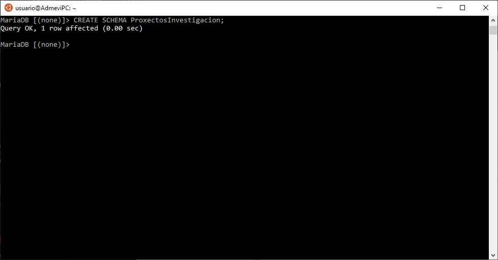
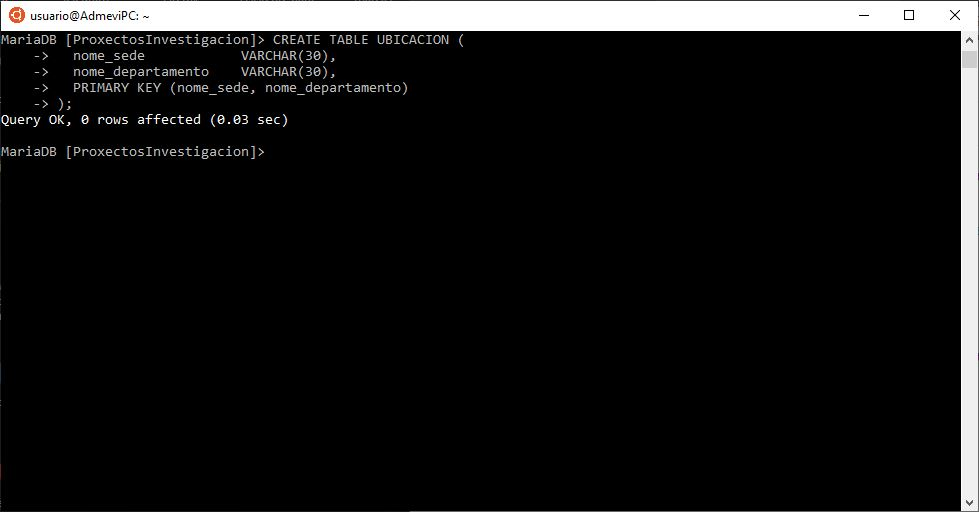
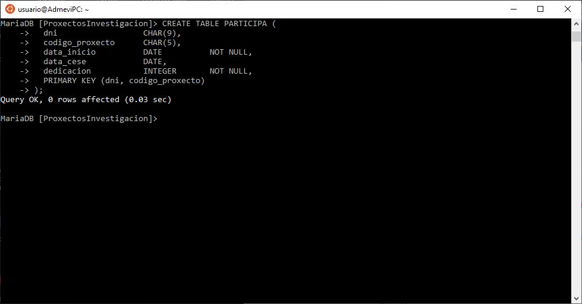
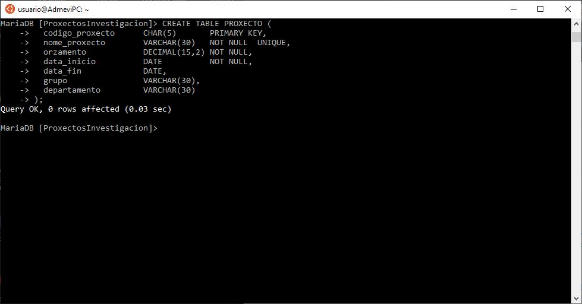
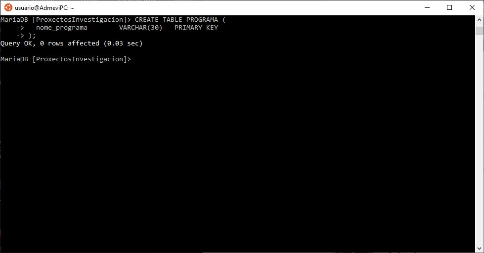
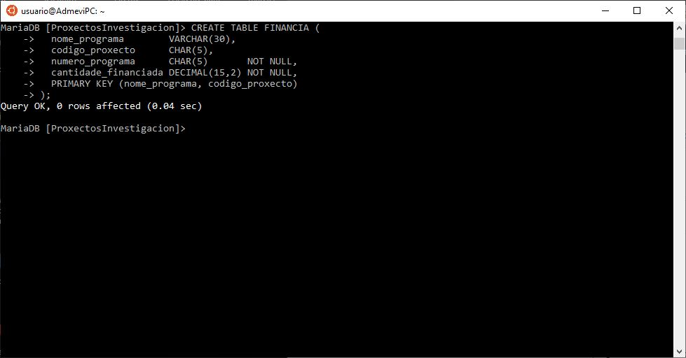

# Ejercicios
> Implementación de los ejercicios realizados en clase en el sistema de gestión de bases de datos MariaDB. [Repositorio de los ejercicios](<https://github.com/davidgchaves/first-steps-with-git-and-github-wirtz-asir1-and-dam1/tree/master/exercicios-ddl>)
## Índice
- [Ejercicio "proxectos de investigación"](#PROXECTOS-DE-INVESTIGACIÓN)
- [Ejercicio "naves espaciais"](#NAVES-ESPACIAIS)

 > 🚩IMPORTANTE: En MariaDB no se pueden crear dominios ni tampoco usar el tipo de dato MONEY. También se agregarán las claves foráneas al final de todo el proceso con la función ALTER, aprovechando que ya estarán todas las tablas creadas de la base de datos.
## PROXECTOS DE INVESTIGACIÓN
Na Universidade de A Coruña deséxase levar un control sobre os proxectos de investigación que se desenvolven. Para iso decídese empregar unha base de datos que conteña toda a información sobre os proxectos, departamentos, grupos de investigación e profesores.

Un departamento identifícase polo seu nome (Informática, Enxeñería, etc). Ten unha sede situada nun determinado campus, un teléfono de contacto e un director, tamén profesor da Universidade de A Coruña.

Dentro dun departamento créanse grupos de investigación. Cada grupo ten un nome único dentro do departamento (pero que pode ser o mesmo en distintos departamentos) e está asociado a unha área de coñecemento (bases de datos, intelixencia artificial, sistemas e comunicacións, etc). Cada grupo ten un líder, tamén profesor da Universidade de A Coruña.

Un profesor está identificado polo seu DNI. Del deséxase saber o nome, tilulación, anos de experiencia en investigación, grupo de investigación no que desenvolve o seu labor e proxectos nos que traballa.

Cada proxecto de investigación ten un nome, un código único, un orzamento, datas de inicio e terminación e un grupo que o desenvolve. Doutra banda, pode estar financiado por varios programas. Dentro de cada programa cada proxecto ten un número asociado e unha cantidade de diñeiro financiada (por exemplo, o proxecto BDE - Bases de Datos Espaciais ten o número 1337 dentro do programa A Solaris e volta que lle financia con 10.000 euros).

Un profesor pode participar en varios proxectos. En cada proxecto incorpórase nunha determinada data e cesa noutra, tendo unha determinada dedicación (en horas á semana) durante ese período.


>1º PASO: Creamos la base de datos.
```sql
CREATE SCHEMA ProxectosInvestigacion;
```



>2º PASO: Creamos la tabla SEDE con sus atributos nome_sede y campus.
```sql
CREATE TABLE SEDE (
  nome_sede            VARCHAR(30)   PRIMARY KEY,
  campus               VARCHAR(30)   NOT NULL
);
```


>3º PASO: Creamos la tabla ubicación con sus atributos nome_sede y nome_departamento con una clave primaria compuesta por ambos atributos.
```sql
CREATE TABLE UBICACION (
  nome_sede            VARCHAR(30),
  nome_departamento    VARCHAR(30),
  PRIMARY KEY (nome_sede, nome_departamento)
);
```



>4º PASO: Creamos la tabla departamento con sus atributos nome_departamento,telefono y director con una clave primaria que es nome_departamento, además, telefono no acepta nulos.
```sql
CREATE TABLE DEPARTAMENTO (
  nome_departamento    VARCHAR(30)   PRIMARY KEY,
  telefono             CHAR(9)       NOT NULL,
  director             CHAR(9)
);
```


>5º PASO: Creamos la tabla grupo con sus atributos nome_grupo, nome_departamento,area y lider con una clave primaria compuesta que es nome_departamento y nome_grupo, además, area no acepta nulos.
```sql
CREATE TABLE GRUPO (
  nome_grupo           VARCHAR(30),
  nome_departamento    VARCHAR(30),
  area                 VARCHAR(30)   NOT NULL,
  lider                CHAR(9),
  PRIMARY KEY (nome_grupo, nome_departamento)
);
```


>6º PASO: Creamos la tabla profesor con sus atributos dni, nome_profesor,titulacion,experiencia,grupo y departamento con una clave primaria que es dni , además, nome_profesor y titulacion no acepta nulos.
```sql
CREATE TABLE PROFESOR (
  dni                  CHAR(9)       PRIMARY KEY,
  nome_profesor        VARCHAR(30)   NOT NULL, 
  titulacion           VARCHAR(20)   NOT NULL,
  experiencia          INTEGER,
  grupo                VARCHAR(30),
  departamento         VARCHAR(30)
);
```


>7º PASO: Creamos la tabla participa con sus atributos dni, codigo_proxecto, data_inicio ,data_cese ,dedicacion con una clave primaria compuesta que es dni y codigo_proxecto, además, data_inicio y dedicacion no acepta nulos.
```sql
CREATE TABLE PARTICIPA (
  dni                  CHAR(9),
  codigo_proxecto      CHAR(5),
  data_inicio          DATE          NOT NULL,
  data_cese            DATE,
  dedicacion           INTEGER       NOT NULL,
  PRIMARY KEY (dni, codigo_proxecto)
);
```



>8º PASO: Creamos la tabla proxecto con sus atributos codigo_proxecto, nome_proxecto (tiene que tener unicidad), orzamento, data_inicio ,data_fin, grupo y departamento con una clave primaria que es codigo_proxecto, además, data_inicio, nome_proxecto y orzamento no acepta nulos.
```sql
CREATE TABLE PROXECTO (
  codigo_proxecto      CHAR(5)       PRIMARY KEY,
  nome_proxecto        VARCHAR(30)   NOT NULL  UNIQUE,
  orzamento            DECIMAL(15,2) NOT NULL,
  data_inicio          DATE          NOT NULL,
  data_fin             DATE,
  grupo                VARCHAR(30),
  departamento         VARCHAR(30)
);
```



>9º PASO: Creamos la tabla programa con sus atributo nome_programa con una clave primaria que es nome_programa.
```sql
CREATE TABLE PROGRAMA (
  nome_programa        VARCHAR(30)   PRIMARY KEY
);
```




>10º PASO: Creamos la tabla financia con sus atributos nome_programa, codigo_proxecto, numero_programa, cantidade_financiada (tenemos que usar tipo de dato decimal, ya que MariaDB no permite el tipo money) con una clave primaria que es nome_programa y codigo_proxecto, además, numero_programa y cantidade_financiada no pueden ser nulos.
```sql
CREATE TABLE FINANCIA (
  nome_programa        VARCHAR(30),
  codigo_proxecto      CHAR(5),
  numero_programa      CHAR(5)       NOT NULL,
  cantidade_financiada DECIMAL(15,2) NOT NULL,
  PRIMARY KEY (nome_programa, codigo_proxecto)
);
```




## NAVES ESPACIAIS
O Ministerio da Exploración Interplanetaria da Federación Unida de Planetas desexa desenvolver un Sistema de Información para a nave espacial Stanisław Lem 72 que proximamente se lanzará ao espazo.

A nave espacial componse de distintas dependencias, e cada unha delas ten un nome, un código (único para cada dependencia), unha función e unha localización. Cada dependencia está baixo o control dun determinado servizo, identificado por un nome e unha clave. Todo servizo da nave (Servizo de Operacións, Comando e Control, Seguridade, etc.) ha de estar asignado polo menos a unha dependencia.

Quérese levar ao día unha relación da tripulación da nave. Esta información contén o nome, código, categoría, antigüidade, procedencia e situación administrativa (en servizo, de baixa, etc). Cada tripulante está asignado a unha dependencia que desexa coñecer, así como a cámara na que se aloxa. Unha cámara é unha dependencia que posúe dúas características propias, a súa categoría e a súa capacidade.

Doutra banda, deséxanse coñecer os planetas que visitou cada membro da tripulación e o tempo que permaneceron neles para saber as persoas con quen se pode contar á hora de realizar unha exploración interplanetaria.

De cada planeta coñécese o seu nome e código, a galaxia e coordenadas nas que se atopa. Algúns planetas atópanse poboados por diversas razas, cada unha nunha certa cantidade de individuos. De cada raza almacénase información sobre o nome, poboación total e dimensións medias (altura, anchura, peso).


