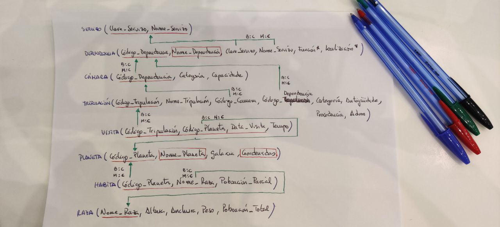

# Ejercicios
> Implementación de los ejercicios realizados en clase en el sistema de gestión de bases de datos MariaDB. [Repositorio de los ejercicios](<https://github.com/davidgchaves/first-steps-with-git-and-github-wirtz-asir1-and-dam1/tree/master/exercicios-ddl>)
## Índice
- [Ejercicio "proxectos de investigación"](#PROXECTOS-DE-INVESTIGACIÓN)
- [Ejercicio "naves espaciais"](#NAVES-ESPACIAIS)

## PROXECTOS DE INVESTIGACIÓN
Na Universidade de A Coruña deséxase levar un control sobre os proxectos de investigación que se desenvolven. Para iso decídese empregar unha base de datos que conteña toda a información sobre os proxectos, departamentos, grupos de investigación e profesores.

Un departamento identifícase polo seu nome (Informática, Enxeñería, etc). Ten unha sede situada nun determinado campus, un teléfono de contacto e un director, tamén profesor da Universidade de A Coruña.

Dentro dun departamento créanse grupos de investigación. Cada grupo ten un nome único dentro do departamento (pero que pode ser o mesmo en distintos departamentos) e está asociado a unha área de coñecemento (bases de datos, intelixencia artificial, sistemas e comunicacións, etc). Cada grupo ten un líder, tamén profesor da Universidade de A Coruña.

Un profesor está identificado polo seu DNI. Del deséxase saber o nome, tilulación, anos de experiencia en investigación, grupo de investigación no que desenvolve o seu labor e proxectos nos que traballa.

Cada proxecto de investigación ten un nome, un código único, un orzamento, datas de inicio e terminación e un grupo que o desenvolve. Doutra banda, pode estar financiado por varios programas. Dentro de cada programa cada proxecto ten un número asociado e unha cantidade de diñeiro financiada (por exemplo, o proxecto BDE - Bases de Datos Espaciais ten o número 1337 dentro do programa A Solaris e volta que lle financia con 10.000 euros).

Un profesor pode participar en varios proxectos. En cada proxecto incorpórase nunha determinada data e cesa noutra, tendo unha determinada dedicación (en horas á semana) durante ese período.

## NAVES ESPACIAIS
O Ministerio da Exploración Interplanetaria da Federación Unida de Planetas desexa desenvolver un Sistema de Información para a nave espacial Stanisław Lem 72 que proximamente se lanzará ao espazo.

A nave espacial componse de distintas dependencias, e cada unha delas ten un nome, un código (único para cada dependencia), unha función e unha localización. Cada dependencia está baixo o control dun determinado servizo, identificado por un nome e unha clave. Todo servizo da nave (Servizo de Operacións, Comando e Control, Seguridade, etc.) ha de estar asignado polo menos a unha dependencia.

Quérese levar ao día unha relación da tripulación da nave. Esta información contén o nome, código, categoría, antigüidade, procedencia e situación administrativa (en servizo, de baixa, etc). Cada tripulante está asignado a unha dependencia que desexa coñecer, así como a cámara na que se aloxa. Unha cámara é unha dependencia que posúe dúas características propias, a súa categoría e a súa capacidade.

Doutra banda, deséxanse coñecer os planetas que visitou cada membro da tripulación e o tempo que permaneceron neles para saber as persoas con quen se pode contar á hora de realizar unha exploración interplanetaria.

De cada planeta coñécese o seu nome e código, a galaxia e coordenadas nas que se atopa. Algúns planetas atópanse poboados por diversas razas, cada unha nunha certa cantidade de individuos. De cada raza almacénase información sobre o nome, poboación total e dimensións medias (altura, anchura, peso).

