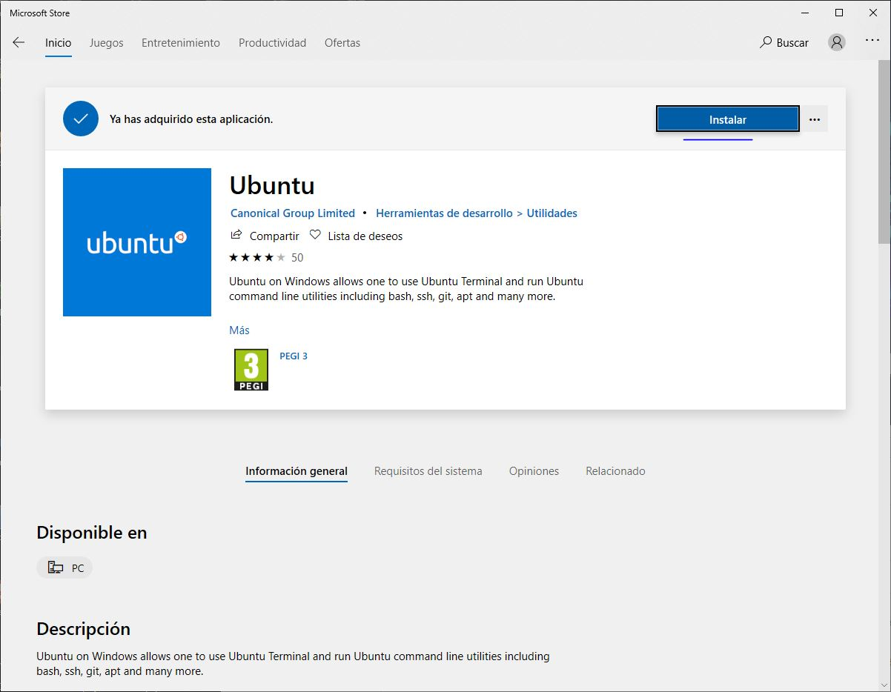
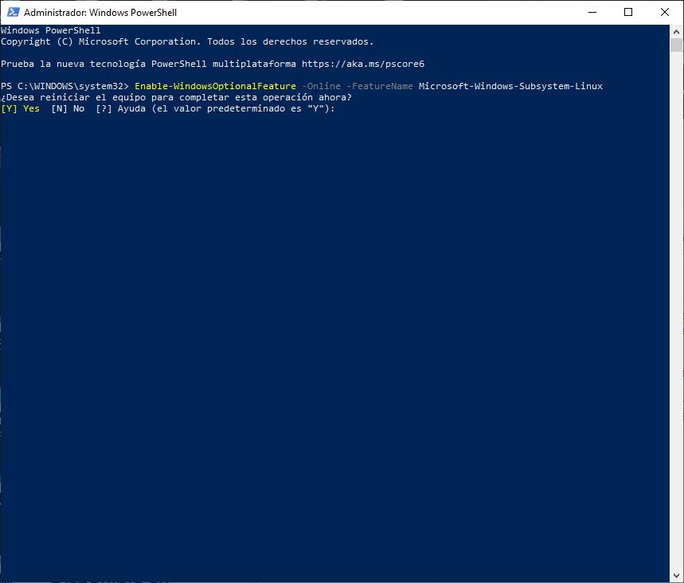
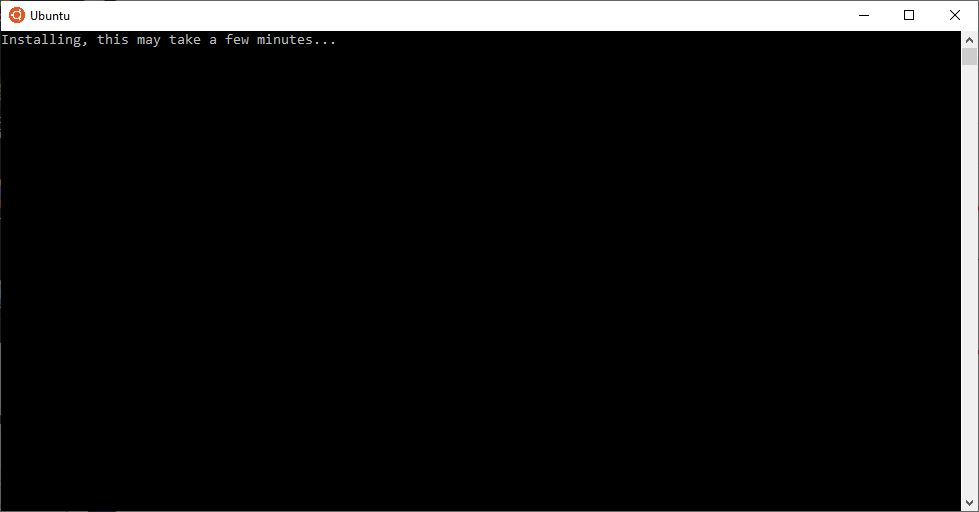
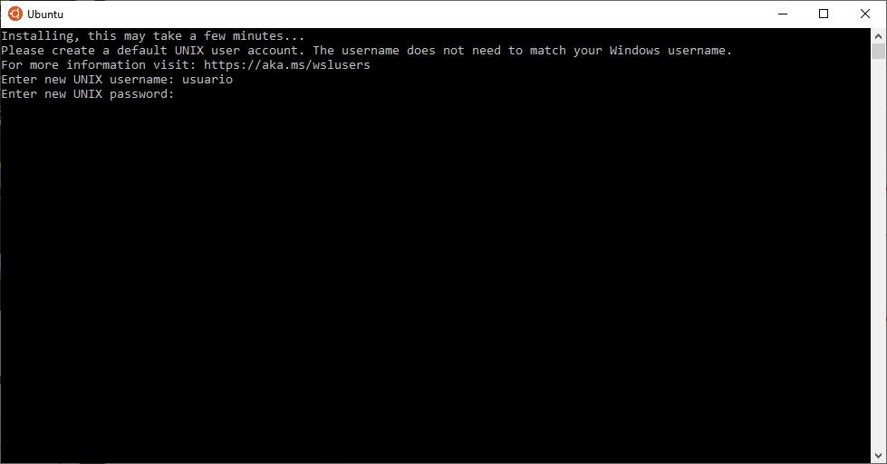
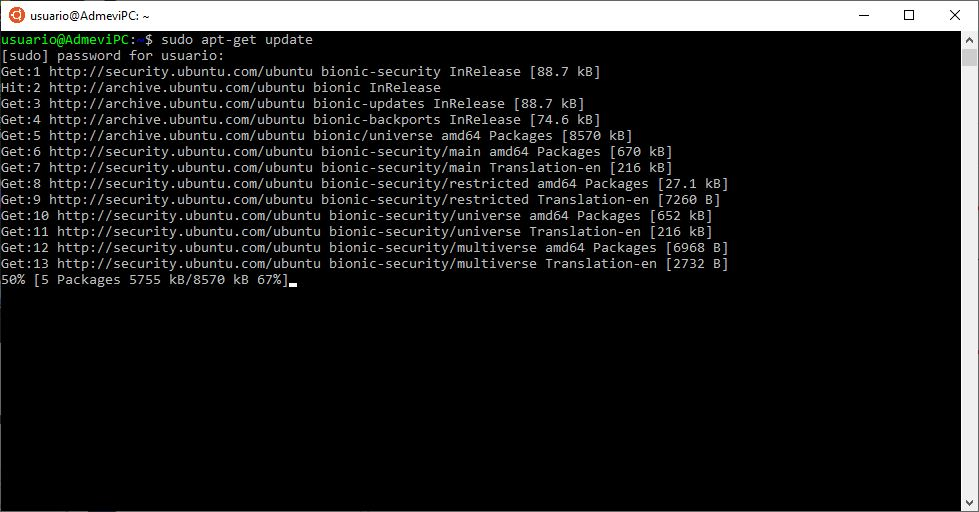
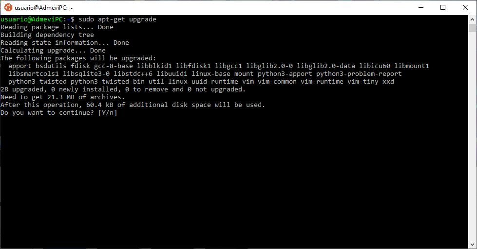
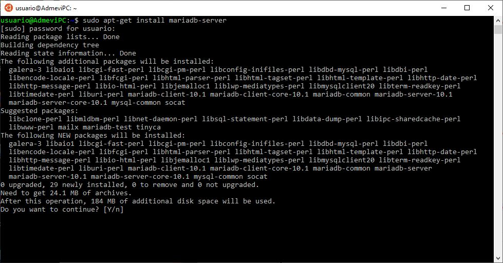
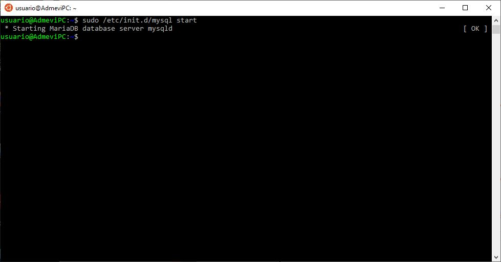
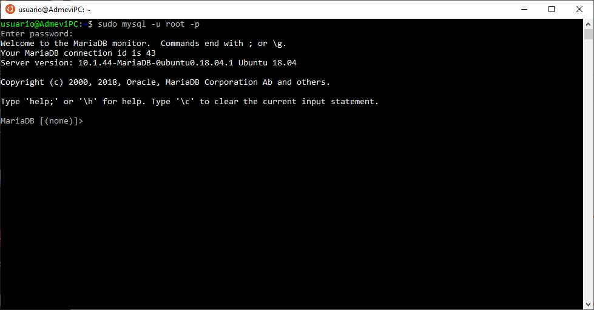
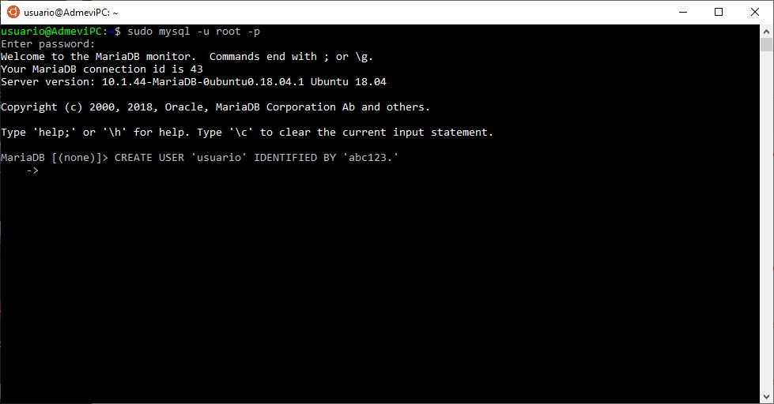

## INSTALACIÓN DE UN SISTEMA GESTOR DE BASES DE DATOS
Instalaremos el gestor de bases de datos MariaDB en Windows 10 a través de linea de comandos, para ello tendremos que seguir los siguientes pasos.

> Instalamos desde la Microsoft Store el terminal Ubuntu para poder realizar posteriormente la instalación de Maria DB



> A continuación abrimos Windows Powershell para activar el subsistema linux para windows con el comando ```Enable-WindowsOptionalFeature -Online -FeatureName Microsoft-Windows-Subsystem-Linux``` . Nos pedirá reiniciar el equipo.



> Abrimos Ubuntu y esperamos a que instale 



> Nos pedirá que le indiquemos un usuario y una contraseña
 


> Ya podemos comenzar a usar el terminal. Lo primero, es actualizar los repositorios con el comando ```apt-get update```



> Ahora, toca actualizar los paquetes del sistema con el comando ```apt-get upgrade```



> Finalizados los pasos previos, ahora procedemos a instalar MariaDB con el comando ```sudo apt-get install mariadb-server```



> Acabada la instalación, procederemos a abrir el servidor de MariaDB, con el comando ```sudo /etc/init.d/mysql start```



> Ahora, procederemos a configurar el usuario root de MariaDB , ejecutando el comando ```sudo mysql -u root -p```



> Ejecutando el comando anterior, ya estamos dentro de la linea de comandos de MariaDB, Ahora, procederemos a crear el usuario con la siguiente sentencia.
```sql
  CREATE USER 'Usuario' IDENTIFIED BY 'abc123.';
```
(En instalaciones serias, se debe usar una contraseña mucho más segura que esta)



### Y con estos pasos, ya tenemos nuestra instalación MariaDB configurada correctamente. Cada vez que queramos entrar, deberemos usar el comando ```mysql -p``` . y a continuación, la contraseña que le hemos asignado al usuario.

